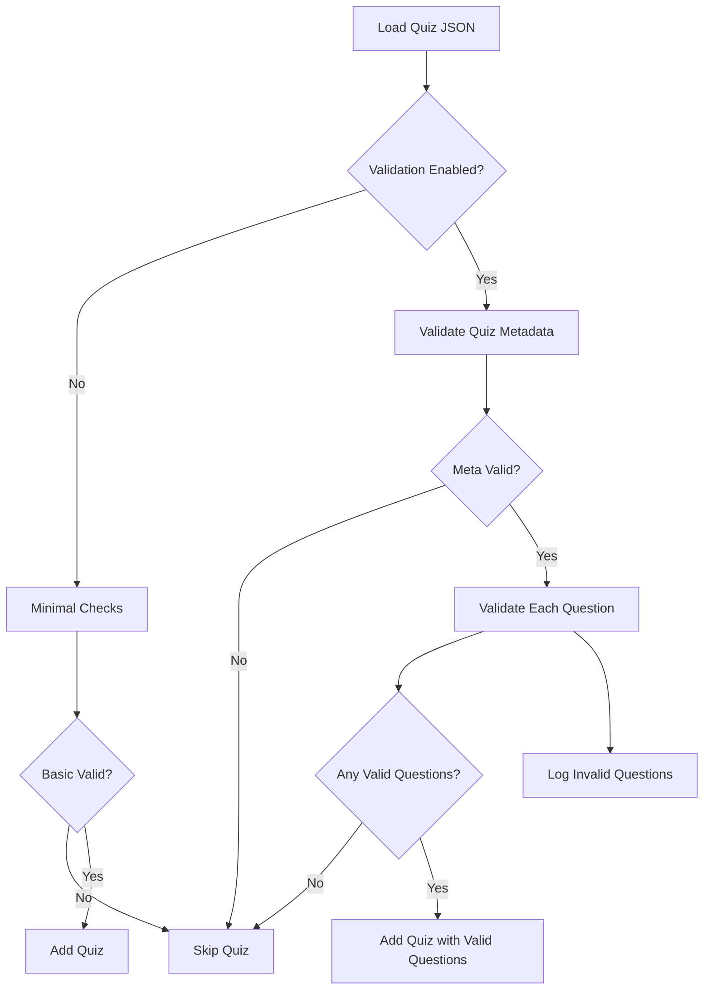

# Quiz Validation System Redesign Plan

## Objectives
- Validate quizzes with 1–100 questions efficiently.
- Provide **clear, question-specific console warnings**.
- **Discard invalid questions** entirely; only valid questions appear to users.
- Accept partially valid quizzes (skip quiz only if metadata invalid or no valid questions).
- Make validation **modular and easily extensible** for new question types or schema changes.
- Keep files around 300 lines for maintainability.
- Improve developer experience with clear logs and easy updates.

---

## 1. Modularize the Validation Codebase

| File | Purpose | Approx. Lines |
|-------|---------|---------------|
| **`src/services/QuizTypes.ts`** | All interfaces/types for quizzes & questions | ~50 |
| **`src/services/TypeGuards.ts`** | Utility type guard functions | ~50 |
| **`src/services/QuestionValidators.ts`** | Per-question-type validation functions, registry | ~150 |
| **`src/services/QuizValidator.ts`** | Quiz-level validation orchestration, console reporting | ~150 |

---

## 2. Validation Flow

1. **Validate Quiz Metadata**
   - `id`, `title`, `category` must be non-empty strings.
   - `questions` must be an array.
   - If metadata invalid, **skip entire quiz**.

2. **Validate Each Question Independently**
   - Use a **registry pattern** to map `type` to a validator function.
   - Each validator returns an array of error strings (empty if valid).
   - Collect:
     - Valid questions.
     - Invalid questions with their index and errors.

3. **Filter Out Invalid Questions**
   - If **no valid questions remain**, skip quiz.
   - Else, create a sanitized quiz object with only valid questions.

4. **Console Reporting**
   - For each invalid question, log:
     ```
     [Quiz 'quizId'] Question #n: <error1>, <error2>, ...
     ```
   - Group logs per quiz for clarity.
   - Log if entire quiz skipped due to metadata or no valid questions.

5. **Return Result**
   - If quiz is valid (meta + ≥1 valid question), return sanitized quiz.
   - Else, skip quiz.

---

## 3. Question Validator Registry

```typescript
type QuestionValidator = (q: any) => string[];

const questionValidators: Record<string, QuestionValidator> = {
  mcq: validateMCQ,
  true_false: validateTrueFalse,
  highlighted_bytes: validateHighlightedBytes,
  hex_selection: validateHexSelection,
  drag_drop: validateDragDrop,
  // Add new types here easily
};

export function validateQuestion(q: any): string[] {
  if (!q || typeof q !== 'object') return ['Question is not an object'];
  if (!('type' in q) || typeof q.type !== 'string') return ['Missing or invalid question type'];
  const validator = questionValidators[q.type];
  if (!validator) return [`Unknown question type '${q.type}'`];
  return validator(q);
}
```

Each `validate<Type>` function returns an array of error strings.

---

## 4. Quiz Validation Function

```typescript
export function validateQuizPartial(quizData: unknown): {
  isValid: boolean;
  validQuiz?: Quiz;
  errors: string[];
} {
  const errors: string[] = [];
  if (!isObject(quizData)) {
    errors.push('Quiz data must be an object.');
    return { isValid: false, errors };
  }

  // Validate metadata
  const id = quizData.id;
  const quizIdStr = isNonEmptyString(id) ? `'${id}'` : 'unknown';
  if (!isNonEmptyString(id)) errors.push(`Quiz ${quizIdStr}: Missing or empty 'id'.`);
  if (!isNonEmptyString(quizData.title)) errors.push(`Quiz ${quizIdStr}: Missing or empty 'title'.`);
  if (!isNonEmptyString(quizData.category)) errors.push(`Quiz ${quizIdStr}: Missing or empty 'category'.`);
  if (!Array.isArray(quizData.questions)) {
    errors.push(`Quiz ${quizIdStr}: 'questions' must be an array.`);
    return { isValid: false, errors };
  }

  if (errors.length > 0) {
    console.groupCollapsed(`Quiz Validation Failed: ${quizIdStr}`);
    errors.forEach(err => console.error(err));
    console.groupEnd();
    return { isValid: false, errors };
  }

  const validQuestions: Question[] = [];
  quizData.questions.forEach((q: any, index: number) => {
    const qErrors = validateQuestion(q);
    if (qErrors.length === 0) {
      validQuestions.push(q as Question);
    } else {
      console.warn(`Quiz ${quizIdStr}, Question ${index + 1}: ${qErrors.join('; ')}`);
    }
  });

  if (validQuestions.length === 0) {
    console.warn(`Quiz ${quizIdStr}: No valid questions found. Skipping quiz.`);
    return { isValid: false, errors: ['No valid questions'] };
  }

  const sanitizedQuiz: Quiz = {
    id,
    title: quizData.title,
    category: quizData.category,
    description: quizData.description,
    questions: validQuestions,
  };

  return { isValid: true, validQuiz: sanitizedQuiz, errors: [] };
}
```

---

## 5. Update `loadQuizzes()` in `QuizProvider.tsx`

Replace:

```typescript
const validationResult = validateQuiz(quizData);
if (!validationResult.isValid) {
  console.warn(`Skipping invalid quiz file due to validation errors: ${path}`);
  continue;
}
loadedQuizzes[validationResult.data!.id] = validationResult.data!;
```

with:

```typescript
const { isValid, validQuiz } = validateQuizPartial(quizData);
if (!isValid || !validQuiz) {
  console.warn(`Skipping invalid or empty quiz: ${path}`);
  continue;
}
loadedQuizzes[validQuiz.id] = validQuiz;
```

---

## 6. Console Logging Strategy

- Use `console.groupCollapsed` per quiz for metadata errors.
- Use `console.warn` for each invalid question.
- Summarize skipped quizzes.
- This provides clear, actionable feedback for quiz authors.

---

## 7. Extensibility

- To add a new question type:
  - Define its interface in `QuizTypes.ts`.
  - Write a validator in `QuestionValidators.ts`.
  - Register it in the `questionValidators` map.
- Minimal changes elsewhere.

---

## 8. Validation Flow Diagram



---

## Summary
- **Granular validation**: Accepts quizzes with at least 1 valid question.
- **Clear console warnings**: Per invalid question, with details.
- **Invalid questions discarded**: Users only see valid content.
- **Modular design**: Easy to extend and maintain.
- **Minimal impact on existing UI**: Only backend validation changes.
- **Performance optimized**: Lightweight, synchronous validation.