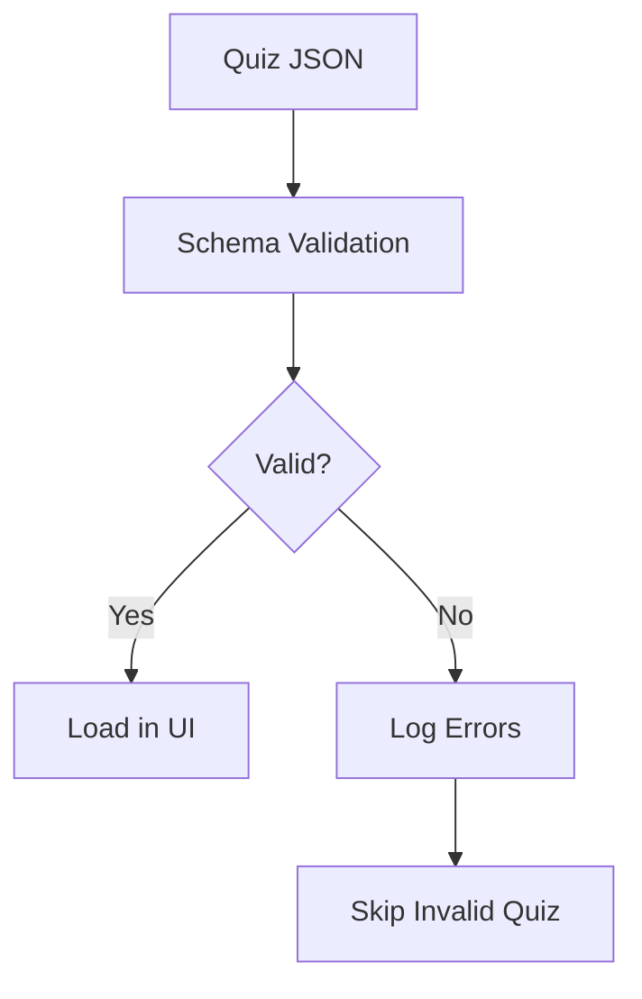

# Quiz Validation System Design

## Validation Architecture



## Implementation Plan

### 1. Schema Definition (Zod)
```typescript
// src/services/QuizValidator.ts
import { z } from "zod";

const baseQuestionSchema = z.object({
  text: z.string().min(10),
  explanation: z.string().optional(),
  difficulty: z.enum(["easy", "medium", "hard"]).optional()
});

const mcqSchema = baseQuestionSchema.extend({
  type: z.literal("mcq"),
  correctAnswers: z.array(z.string()).min(1),
  wrongAnswers: z.array(z.string()).min(1)
});

const trueFalseSchema = baseQuestionSchema.extend({
  type: z.literal("true_false"),
  correctAnswer: z.boolean()
});

// ... other question types

export const quizSchema = z.object({
  id: z.string().min(3),
  title: z.string().min(5),
  description: z.string().optional(),
  category: z.string().min(3),
  questions: z.array(z.union([mcqSchema, trueFalseSchema])).min(1)
});
```

### 2. Validation Workflow
1. Parse JSON with error handling
2. Validate against schema
3. Collect all validation errors
4. Output errors to console
5. Skip quizzes with fatal errors

### 3. Error Handling
```typescript
interface ValidationResult {
  isValid: boolean;
  errors: Array<{
    path: string;
    message: string;
    received?: unknown;
  }>;
}

function validateQuiz(quizData: unknown): ValidationResult {
  // Implementation details...
}
```

### 4. UI Integration
- Add error boundary component
- Filter invalid quizzes in QuizBrowser
- Show warning icon for admins
- Maintain error logs in development mode

## Required Dependencies
- Install Zod: `npm install zod`
- Update QuizProvider types
- Add error logging service

## Next Steps
1. Switch to Code mode to implement
2. Create validation service
3. Update quiz loading logic
4. Add error reporting UI componentsne